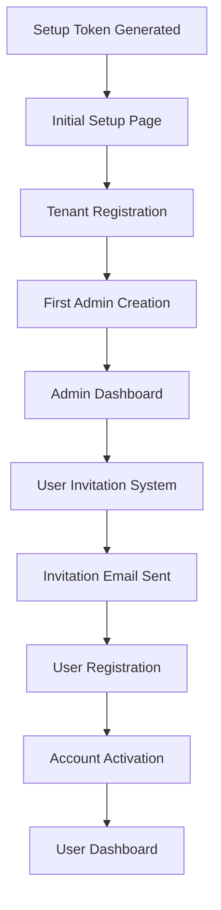
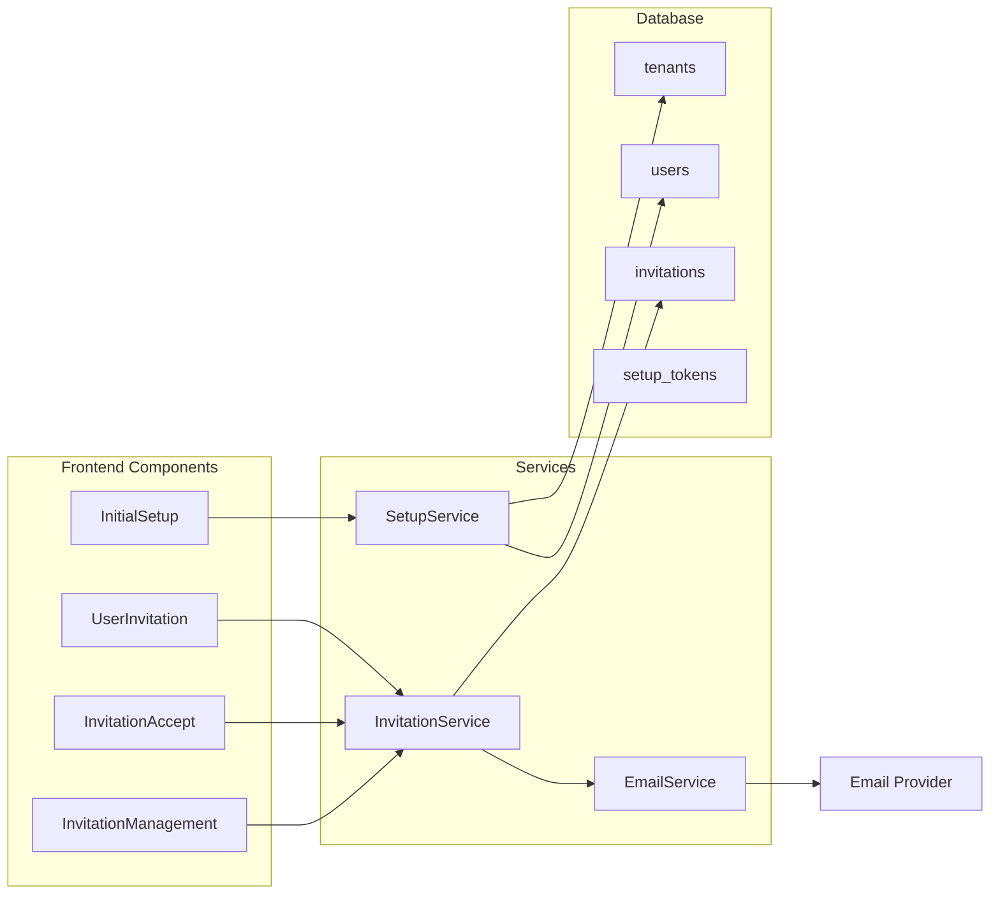

# Design Document

## Overview

The Initial System Setup and User Onboarding feature addresses the critical gap in the current School Counselor Ledger application where no mechanism exists for initial admin registration. This design implements a secure, multi-step onboarding process that enables schools and districts to establish their tenant, create their first admin user, and subsequently invite additional users through a robust invitation system.

The solution maintains the existing multi-tenant architecture while adding secure token-based flows for initial setup and user invitations. It integrates with Supabase Auth for user authentication while extending the application's user management capabilities.

## Architecture

### High-Level Flow



### Component Architecture



## Components and Interfaces

### Database Schema Extensions

#### Setup Tokens Table
```sql
CREATE TABLE setup_tokens (
  id UUID PRIMARY KEY DEFAULT gen_random_uuid(),
  token TEXT UNIQUE NOT NULL,
  tenant_name TEXT NOT NULL,
  tenant_subdomain TEXT NOT NULL,
  admin_email TEXT NOT NULL,
  expires_at TIMESTAMPTZ NOT NULL,
  used_at TIMESTAMPTZ,
  created_at TIMESTAMPTZ DEFAULT NOW()
);
```

#### Invitations Table
```sql
CREATE TABLE invitations (
  id UUID PRIMARY KEY DEFAULT gen_random_uuid(),
  tenant_id UUID NOT NULL REFERENCES tenants(id) ON DELETE CASCADE,
  email TEXT NOT NULL,
  role TEXT NOT NULL CHECK (role IN ('ADMIN', 'COUNSELOR')),
  invited_by UUID NOT NULL REFERENCES users(id) ON DELETE CASCADE,
  token TEXT UNIQUE NOT NULL,
  expires_at TIMESTAMPTZ NOT NULL,
  accepted_at TIMESTAMPTZ,
  created_at TIMESTAMPTZ DEFAULT NOW(),
  UNIQUE(tenant_id, email)
);
```

### Frontend Components

#### InitialSetupPage Component
```typescript
interface InitialSetupPageProps {
  setupToken: string;
}

interface TenantSetupForm {
  tenantName: string;
  subdomain: string;
  adminFirstName: string;
  adminLastName: string;
  adminEmail: string;
  adminPassword: string;
  confirmPassword: string;
}
```

#### UserInvitationForm Component
```typescript
interface UserInvitationFormProps {
  onInvitationSent: (invitation: Invitation) => void;
}

interface InvitationForm {
  email: string;
  firstName: string;
  lastName: string;
  role: UserRole;
}
```

#### InvitationAcceptPage Component
```typescript
interface InvitationAcceptPageProps {
  invitationToken: string;
}

interface UserRegistrationForm {
  firstName: string;
  lastName: string;
  password: string;
  confirmPassword: string;
}
```

### Service Interfaces

#### SetupService
```typescript
interface SetupService {
  validateSetupToken(token: string): Promise<SetupTokenValidation>;
  createTenantAndAdmin(setupData: TenantSetupData): Promise<SetupResult>;
  completeInitialSetup(token: string, setupData: TenantSetupData): Promise<User>;
}

interface SetupTokenValidation {
  isValid: boolean;
  tenantName?: string;
  adminEmail?: string;
  expiresAt?: Date;
}
```

#### InvitationService
```typescript
interface InvitationService {
  createInvitation(invitationData: InvitationData): Promise<Invitation>;
  validateInvitationToken(token: string): Promise<InvitationValidation>;
  acceptInvitation(token: string, userData: UserRegistrationData): Promise<User>;
  getPendingInvitations(tenantId: string): Promise<Invitation[]>;
  cancelInvitation(invitationId: string): Promise<void>;
  resendInvitation(invitationId: string): Promise<void>;
}
```

## Data Models

### SetupToken Model
```typescript
interface SetupToken {
  id: string;
  token: string;
  tenantName: string;
  tenantSubdomain: string;
  adminEmail: string;
  expiresAt: Date;
  usedAt?: Date;
  createdAt: Date;
}
```

### Invitation Model
```typescript
interface Invitation {
  id: string;
  tenantId: string;
  email: string;
  role: UserRole;
  invitedBy: string;
  token: string;
  expiresAt: Date;
  acceptedAt?: Date;
  createdAt: Date;
}
```

### Extended Tenant Model
```typescript
interface TenantSetupData {
  name: string;
  subdomain: string;
  adminFirstName: string;
  adminLastName: string;
  adminEmail: string;
  adminPassword: string;
}
```
##
 Correctness Properties

*A property is a characteristic or behavior that should hold true across all valid executions of a system-essentially, a formal statement about what the system should do. Properties serve as the bridge between human-readable specifications and machine-verifiable correctness guarantees.*

After reviewing the acceptance criteria, I've identified several redundant properties that can be consolidated:
- Properties 2.3 and 3.1 both test invitation link display functionality - these can be combined
- Properties 2.4 and 3.3 both test user account creation - these can be combined into a comprehensive property
- Several token validation properties can be consolidated into broader token lifecycle properties

**Property 1: Setup token validation and single use**
*For any* valid setup token, accessing the setup page should display the registration form, and completing setup should invalidate the token for future use
**Validates: Requirements 1.1, 1.4**

**Property 2: Tenant and admin creation atomicity**
*For any* valid tenant setup data, the system should create both the tenant record and the first admin user account, or neither if any step fails
**Validates: Requirements 1.2, 1.3**

**Property 3: Setup token security enforcement**
*For any* invalid, expired, or used setup token, accessing the setup page should redirect to the login page
**Validates: Requirements 1.5**

**Property 4: Invitation token lifecycle management**
*For any* invitation creation, the system should generate a secure token with future expiration, and mark it invalid after use or expiration
**Validates: Requirements 2.1, 2.5**

**Property 5: Invitation email delivery**
*For any* created invitation, the system should send an email to the specified address containing the correct invitation link
**Validates: Requirements 2.2**

**Property 6: Invitation acceptance and user creation**
*For any* valid invitation token, accessing the link should display a pre-populated registration form, and completing registration should create both Supabase auth and application user accounts with the correct role
**Validates: Requirements 2.3, 2.4, 3.1, 3.2, 3.3**

**Property 7: Post-registration authentication**
*For any* completed user registration via invitation, the system should automatically authenticate the user and redirect to the dashboard
**Validates: Requirements 3.4**

**Property 8: Invalid invitation handling**
*For any* expired or invalid invitation token, accessing the link should display an appropriate error message
**Validates: Requirements 3.5**

**Property 9: Invitation management operations**
*For any* pending invitation, admins should be able to view, cancel, or resend it, with each operation updating the invitation state correctly
**Validates: Requirements 4.1, 4.2, 4.3**

**Property 10: Invitation status synchronization**
*For any* invitation that expires or gets accepted, the system should automatically update its status in the admin interface
**Validates: Requirements 4.4, 4.5**

**Property 11: Duplicate email prevention**
*For any* registration attempt with an email that already exists in the tenant, the system should prevent account creation
**Validates: Requirements 5.1**

**Property 12: Token single-use enforcement**
*For any* invitation token, only the first successful registration attempt should succeed, with subsequent attempts being rejected
**Validates: Requirements 5.4**

**Property 13: Invitation token navigation persistence**
*For any* valid invitation token, navigating away and returning should preserve token validity until expiration or use
**Validates: Requirements 5.3**

**Property 14: Security event logging**
*For any* suspicious invitation usage pattern, the system should log appropriate security events
**Validates: Requirements 5.5**

**Property 15: Tenant configuration validation**
*For any* initial setup attempt, the system should require tenant name and subdomain, and validate subdomain uniqueness
**Validates: Requirements 6.1, 6.2**

**Property 16: Tenant association consistency**
*For any* completed tenant setup, all subsequently created users should be associated with the correct tenant
**Validates: Requirements 6.3**

**Property 17: Contact information persistence**
*For any* initial setup that includes contact information, the system should store it for administrative access
**Validates: Requirements 6.4**

**Property 18: Token cryptographic security**
*For any* generated invitation or setup token, it should be cryptographically secure and unpredictable
**Validates: Requirements 7.1**

**Property 19: Sensitive data protection**
*For any* invitation data stored in the database, sensitive information should be properly hashed or encrypted
**Validates: Requirements 7.2**

**Property 20: Secure email delivery**
*For any* invitation email sent, it should use secure delivery methods with proper authentication
**Validates: Requirements 7.3**

**Property 21: Automatic cleanup of expired tokens**
*For any* expired invitation or setup token, the system should automatically clean up the record
**Validates: Requirements 7.4**

**Property 22: Rate limiting protection**
*For any* rapid succession of invitation attempts from the same source, the system should implement rate limiting
**Validates: Requirements 7.5**

## Error Handling

### Setup Token Errors
- **Invalid Token**: Redirect to login with clear error message
- **Expired Token**: Display expiration notice with contact information
- **Already Used Token**: Show completion status or redirect to login
- **Malformed Token**: Treat as invalid and redirect

### Invitation Errors
- **Expired Invitation**: Display expiration message with admin contact
- **Invalid Token**: Show error with option to request new invitation
- **Email Already Exists**: Prevent registration with clear error message
- **Network Failures**: Retry mechanism with exponential backoff

### Database Errors
- **Constraint Violations**: Roll back transactions and show user-friendly errors
- **Connection Issues**: Queue operations for retry when connection restored
- **Duplicate Subdomain**: Immediate validation feedback during input

### Email Delivery Errors
- **SMTP Failures**: Log errors and provide admin notification
- **Invalid Email Addresses**: Validate before invitation creation
- **Rate Limiting**: Implement exponential backoff for email sending

## Testing Strategy

### Unit Testing Approach
The system will use comprehensive unit tests to verify individual component behavior:

- **Form Validation Tests**: Verify all input validation rules work correctly
- **Token Generation Tests**: Ensure tokens meet security requirements
- **Database Operation Tests**: Test CRUD operations for setup and invitation data
- **Email Service Tests**: Mock email delivery to verify correct content and recipients
- **Error Handling Tests**: Verify proper error responses for all failure scenarios

### Property-Based Testing Approach
The system will implement property-based tests using **fast-check** for JavaScript/TypeScript to verify universal properties across all valid inputs:

- **Token Security Properties**: Generate random tokens and verify cryptographic strength
- **Setup Flow Properties**: Test setup completion with various valid tenant configurations
- **Invitation Lifecycle Properties**: Verify invitation creation, acceptance, and expiration cycles
- **User Creation Properties**: Test user account creation with various role and tenant combinations
- **Security Properties**: Verify rate limiting, duplicate prevention, and access control

Each property-based test will run a minimum of 100 iterations to ensure comprehensive coverage. Property-based tests will be tagged with comments explicitly referencing the correctness property from this design document using the format: **Feature: initial-system-setup, Property {number}: {property_text}**

### Integration Testing
- **End-to-End Setup Flow**: Complete tenant setup from token to admin login
- **Full Invitation Cycle**: From invitation creation to user registration and login
- **Multi-User Scenarios**: Test concurrent invitations and registrations
- **Email Integration**: Verify actual email delivery in staging environment

### Security Testing
- **Token Manipulation**: Attempt to forge or modify tokens
- **Rate Limiting**: Verify protection against invitation spam
- **SQL Injection**: Test all input fields for injection vulnerabilities
- **Cross-Tenant Access**: Ensure proper tenant isolation

## Implementation Notes

### Security Considerations
1. **Token Generation**: Use cryptographically secure random number generation
2. **Token Storage**: Hash tokens before database storage, store only hashes
3. **Email Security**: Use authenticated SMTP with TLS encryption
4. **Rate Limiting**: Implement per-IP and per-user rate limiting
5. **Input Validation**: Sanitize all user inputs before processing

### Performance Considerations
1. **Token Cleanup**: Implement background job for expired token cleanup
2. **Email Queue**: Use asynchronous email sending to prevent blocking
3. **Database Indexing**: Index frequently queried fields (tokens, emails, tenant_id)
4. **Caching**: Cache tenant information for faster lookups

### Scalability Considerations
1. **Horizontal Scaling**: Design stateless services for easy scaling
2. **Database Partitioning**: Consider partitioning by tenant for large deployments
3. **Email Service**: Use external email service (SendGrid, AWS SES) for reliability
4. **Monitoring**: Implement comprehensive logging and monitoring for all flows