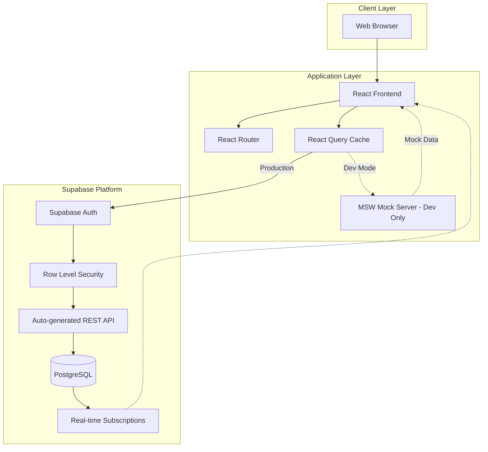
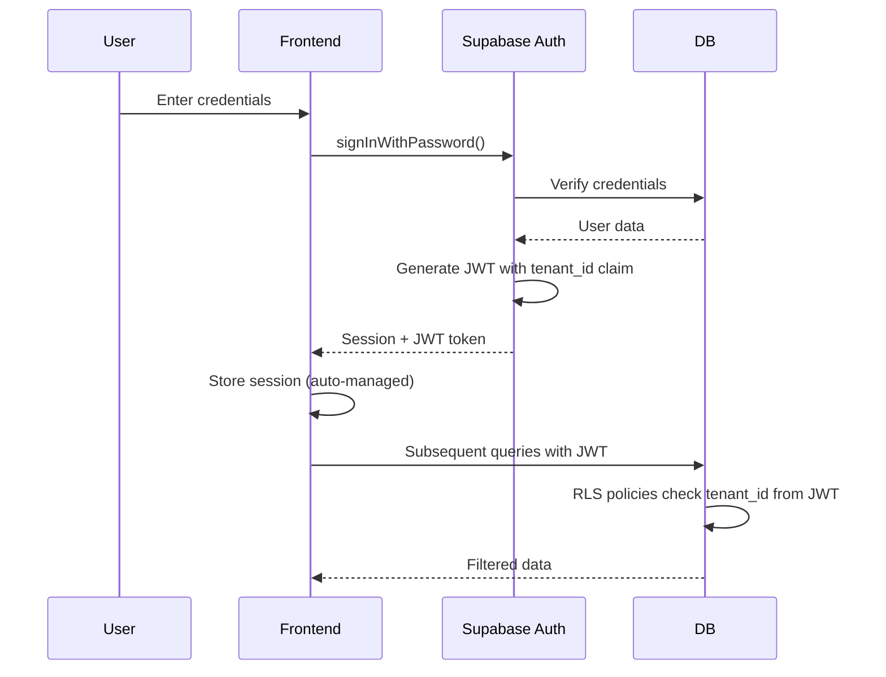

# Design Document: School Counselor Ledger

## Overview

The School Counselor Ledger is a multi-tenant SaaS application built with a modern web stack. The system uses a three-tier architecture with a React-based frontend, Node.js/Express backend API, and PostgreSQL database. The application emphasizes security, scalability, and user experience with role-based access control, real-time data updates, and responsive design.

### Technology Stack

**Frontend:**
- Vite + React 18+ with TypeScript
- Tailwind CSS for styling
- React Router for navigation
- React Query for data fetching and caching
- FullCalendar for calendar interface
- Recharts for data visualization
- Shadcn/ui for component library
- Zod for form validation
- Vite for fast dev server and optimized builds

**Backend:**
- Supabase (PostgreSQL + Auth + Real-time + Storage)
- Supabase JS Client for API calls
- Row Level Security (RLS) for multi-tenant isolation
- Built-in JWT authentication
- Edge Functions for custom business logic (if needed)

**Database:**
- Supabase PostgreSQL
- Multi-tenant data isolation using Row Level Security (RLS)
- Automatic REST API generation

**Local Development:**
- Mock Service Worker (MSW) for API mocking
- Faker.js for generating realistic test data
- Local Supabase instance via Docker (optional)
- Mock data factories for students, interactions, contacts

**Infrastructure:**
- Supabase hosted platform
- Environment-based configuration
- RESTful API auto-generated by Supabase

## Architecture

### System Architecture Diagram



### Multi-Tenant Architecture

The application implements a shared database, shared schema multi-tenancy model using Supabase Row Level Security:
- Each tenant (school) has a unique `tenant_id`
- All database tables include `tenant_id` as a foreign key
- Row Level Security (RLS) policies automatically filter queries by tenant context
- Complete data isolation between tenants enforced at database level
- Tenant context established during authentication via JWT claims
- RLS policies ensure users can only access data from their tenant

**Benefits of Supabase RLS for Multi-Tenancy:**
- Security enforced at database level (not just application level)
- Automatic filtering - no need to add WHERE tenant_id clauses
- Protection against SQL injection and application bugs
- Simplified backend code

### Authentication Flow



### Local Development with Mock Data

For local development, the application uses Mock Service Worker (MSW) to intercept API calls:

```typescript
// Mock data is enabled via environment variable
if (import.meta.env.VITE_USE_MOCK_DATA === 'true') {
  // MSW intercepts Supabase API calls
  // Returns realistic mock data from factories
}
```

**Mock Data Strategy:**
- Faker.js generates realistic names, emails, dates
- Factory functions create consistent test data
- Seed data includes multiple tenants, users, students, interactions
- Mock data persists in localStorage for session continuity
- Easy toggle between mock and real Supabase backend

## Components and Interfaces

### Frontend Component Structure

```
src/
├── components/
│   ├── common/
│   │   ├── Button.tsx
│   │   ├── Input.tsx
│   │   ├── Select.tsx
│   │   ├── Modal.tsx
│   │   ├── Table.tsx
│   │   └── SearchableDropdown.tsx
│   ├── layout/
│   │   ├── AppLayout.tsx
│   │   ├── Sidebar.tsx
│   │   ├── Header.tsx
│   │   └── Navigation.tsx
│   ├── dashboard/
│   │   ├── DashboardStats.tsx
│   │   ├── InteractionChart.tsx
│   │   └── RecentActivity.tsx
│   ├── interactions/
│   │   ├── InteractionForm.tsx
│   │   ├── InteractionList.tsx
│   │   ├── InteractionDetail.tsx
│   │   ├── ReasonSelector.tsx
│   │   └── RegardingStudentSelector.tsx
│   ├── calendar/
│   │   ├── CalendarView.tsx
│   │   ├── EventModal.tsx
│   │   └── CalendarFilters.tsx
│   ├── students/
│   │   ├── StudentList.tsx
│   │   ├── StudentProfile.tsx
│   │   ├── StudentSearch.tsx
│   │   └── InteractionHistory.tsx
│   ├── contacts/
│   │   ├── ContactList.tsx
│   │   ├── ContactDetail.tsx
│   │   └── ContactForm.tsx
│   ├── reports/
│   │   ├── ReportFilters.tsx
│   │   ├── VolumeReport.tsx
│   │   ├── FrequencyReport.tsx
│   │   ├── GradeLevelReport.tsx
│   │   └── TimeAllocationReport.tsx
│   └── admin/
│       ├── UserManagement.tsx
│       ├── ReasonManagement.tsx
│       └── SystemSettings.tsx
├── hooks/
│   ├── useAuth.ts
│   ├── useInteractions.ts
│   ├── useStudents.ts
│   ├── useContacts.ts
│   └── useReports.ts
├── services/
│   ├── supabase.ts
│   ├── auth.ts
│   └── storage.ts
├── mocks/
│   ├── browser.ts
│   ├── handlers.ts
│   ├── factories/
│   │   ├── userFactory.ts
│   │   ├── studentFactory.ts
│   │   ├── interactionFactory.ts
│   │   └── contactFactory.ts
│   └── data/
│       └── seedData.ts
├── types/
│   ├── user.ts
│   ├── interaction.ts
│   ├── student.ts
│   └── contact.ts
└── utils/
    ├── dateHelpers.ts
    ├── validators.ts
    └── formatters.ts
```

### Supabase Database Structure

```
supabase/
├── migrations/
│   ├── 001_initial_schema.sql
│   ├── 002_rls_policies.sql
│   └── 003_seed_data.sql
├── functions/
│   └── custom-reports/
│       └── index.ts
└── config.toml
```

**Note:** Most backend logic is handled by Supabase's auto-generated API and RLS policies. Custom business logic can be added via Edge Functions if needed.

### Supabase Client Usage

Supabase auto-generates REST API endpoints. The frontend uses the Supabase JS client:

**Authentication:**
```typescript
// Login
await supabase.auth.signInWithPassword({ email, password })

// Logout
await supabase.auth.signOut()

// Get current user
const { data: { user } } = await supabase.auth.getUser()
```

**Data Operations (Examples):**
```typescript
// List interactions (RLS auto-filters by tenant)
const { data } = await supabase
  .from('interactions')
  .select('*, student(*), contact(*), regarding_student:regardingStudentId(*), category(*)')
  .order('startTime', { ascending: false })

// Create contact interaction with regarding student
await supabase
  .from('interactions')
  .insert({ 
    contactId, 
    regardingStudentId, 
    categoryId, 
    startTime, 
    durationMinutes, 
    notes 
  })

// Get student interaction history (including contact interactions about this student)
const { data } = await supabase
  .from('interactions')
  .select(`
    *,
    contact(*),
    category(*),
    subcategory(*)
  `)
  .or(`studentId.eq.${studentId},regardingStudentId.eq.${studentId}`)
  .order('startTime', { ascending: false })

// Complex query with joins
const { data } = await supabase
  .from('students')
  .select(`
    *,
    interactions(count),
    interactions(durationMinutes),
    regarding_interactions:interactions!regardingStudentId(count)
  `)
  .eq('needsFollowUp', true)
```

**Real-time Subscriptions:**
```typescript
// Subscribe to new interactions
supabase
  .channel('interactions')
  .on('postgres_changes', 
    { event: 'INSERT', schema: 'public', table: 'interactions' },
    (payload) => {
      // Update UI with new interaction
    }
  )
  .subscribe()
```

## Data Models

### Database Schema (SQL)

```sql
-- Tenant table for multi-tenancy
CREATE TABLE tenants (
  id UUID PRIMARY KEY DEFAULT gen_random_uuid(),
  name TEXT NOT NULL,
  subdomain TEXT UNIQUE NOT NULL,
  created_at TIMESTAMPTZ DEFAULT NOW(),
  updated_at TIMESTAMPTZ DEFAULT NOW()
);

-- Users table (extends Supabase auth.users)
CREATE TABLE users (
  id UUID PRIMARY KEY REFERENCES auth.users(id),
  tenant_id UUID NOT NULL REFERENCES tenants(id),
  email TEXT NOT NULL,
  first_name TEXT NOT NULL,
  last_name TEXT NOT NULL,
  role TEXT NOT NULL CHECK (role IN ('ADMIN', 'COUNSELOR')),
  is_active BOOLEAN DEFAULT TRUE,
  created_at TIMESTAMPTZ DEFAULT NOW(),
  updated_at TIMESTAMPTZ DEFAULT NOW(),
  UNIQUE(tenant_id, email)
);

CREATE INDEX idx_users_tenant ON users(tenant_id);

-- Students table
CREATE TABLE students (
  id UUID PRIMARY KEY DEFAULT gen_random_uuid(),
  tenant_id UUID NOT NULL REFERENCES tenants(id),
  student_id TEXT NOT NULL,
  first_name TEXT NOT NULL,
  last_name TEXT NOT NULL,
  grade_level TEXT NOT NULL,
  email TEXT,
  phone TEXT,
  needs_follow_up BOOLEAN DEFAULT FALSE,
  follow_up_notes TEXT,
  created_at TIMESTAMPTZ DEFAULT NOW(),
  updated_at TIMESTAMPTZ DEFAULT NOW(),
  UNIQUE(tenant_id, student_id)
);

CREATE INDEX idx_students_tenant ON students(tenant_id);
CREATE INDEX idx_students_name ON students(tenant_id, last_name);

-- Contacts table
CREATE TABLE contacts (
  id UUID PRIMARY KEY DEFAULT gen_random_uuid(),
  tenant_id UUID NOT NULL REFERENCES tenants(id),
  first_name TEXT NOT NULL,
  last_name TEXT NOT NULL,
  relationship TEXT NOT NULL,
  email TEXT,
  phone TEXT,
  organization TEXT,
  notes TEXT,
  created_at TIMESTAMPTZ DEFAULT NOW(),
  updated_at TIMESTAMPTZ DEFAULT NOW()
);

CREATE INDEX idx_contacts_tenant ON contacts(tenant_id);
CREATE INDEX idx_contacts_name ON contacts(tenant_id, last_name);

-- Reason categories table
CREATE TABLE reason_categories (
  id UUID PRIMARY KEY DEFAULT gen_random_uuid(),
  tenant_id UUID NOT NULL REFERENCES tenants(id),
  name TEXT NOT NULL,
  color TEXT,
  sort_order INT DEFAULT 0,
  created_at TIMESTAMPTZ DEFAULT NOW(),
  updated_at TIMESTAMPTZ DEFAULT NOW()
);

CREATE INDEX idx_reason_categories_tenant ON reason_categories(tenant_id);

-- Reason subcategories table
CREATE TABLE reason_subcategories (
  id UUID PRIMARY KEY DEFAULT gen_random_uuid(),
  category_id UUID NOT NULL REFERENCES reason_categories(id) ON DELETE CASCADE,
  name TEXT NOT NULL,
  sort_order INT DEFAULT 0,
  created_at TIMESTAMPTZ DEFAULT NOW(),
  updated_at TIMESTAMPTZ DEFAULT NOW()
);

CREATE INDEX idx_reason_subcategories_category ON reason_subcategories(category_id);

-- Interactions table
CREATE TABLE interactions (
  id UUID PRIMARY KEY DEFAULT gen_random_uuid(),
  tenant_id UUID NOT NULL REFERENCES tenants(id),
  counselor_id UUID NOT NULL REFERENCES users(id),
  student_id UUID REFERENCES students(id),
  contact_id UUID REFERENCES contacts(id),
  regarding_student_id UUID REFERENCES students(id), -- New field for contact interactions
  category_id UUID NOT NULL REFERENCES reason_categories(id),
  subcategory_id UUID REFERENCES reason_subcategories(id),
  custom_reason TEXT,
  start_time TIMESTAMPTZ NOT NULL,
  duration_minutes INT NOT NULL,
  end_time TIMESTAMPTZ GENERATED ALWAYS AS (start_time + (duration_minutes || ' minutes')::INTERVAL) STORED,
  notes TEXT,
  needs_follow_up BOOLEAN DEFAULT FALSE,
  follow_up_date TIMESTAMPTZ,
  follow_up_notes TEXT,
  is_follow_up_complete BOOLEAN DEFAULT FALSE,
  created_at TIMESTAMPTZ DEFAULT NOW(),
  updated_at TIMESTAMPTZ DEFAULT NOW(),
  CHECK (student_id IS NOT NULL OR contact_id IS NOT NULL),
  CHECK (contact_id IS NULL OR regarding_student_id IS NULL OR regarding_student_id IS NOT NULL) -- regarding_student_id only valid for contact interactions
);

CREATE INDEX idx_interactions_tenant ON interactions(tenant_id);
CREATE INDEX idx_interactions_counselor ON interactions(tenant_id, counselor_id);
CREATE INDEX idx_interactions_student ON interactions(tenant_id, student_id);
CREATE INDEX idx_interactions_contact ON interactions(tenant_id, contact_id);
CREATE INDEX idx_interactions_regarding_student ON interactions(tenant_id, regarding_student_id);
CREATE INDEX idx_interactions_time ON interactions(tenant_id, start_time);

-- Row Level Security Policies
ALTER TABLE users ENABLE ROW LEVEL SECURITY;
ALTER TABLE students ENABLE ROW LEVEL SECURITY;
ALTER TABLE contacts ENABLE ROW LEVEL SECURITY;
ALTER TABLE reason_categories ENABLE ROW LEVEL SECURITY;
ALTER TABLE reason_subcategories ENABLE ROW LEVEL SECURITY;
ALTER TABLE interactions ENABLE ROW LEVEL SECURITY;

-- RLS Policy: Users can only see data from their tenant
CREATE POLICY tenant_isolation_users ON users
  FOR ALL
  USING (tenant_id = (SELECT tenant_id FROM users WHERE id = auth.uid()));

CREATE POLICY tenant_isolation_students ON students
  FOR ALL
  USING (tenant_id = (SELECT tenant_id FROM users WHERE id = auth.uid()));

CREATE POLICY tenant_isolation_contacts ON contacts
  FOR ALL
  USING (tenant_id = (SELECT tenant_id FROM users WHERE id = auth.uid()));

CREATE POLICY tenant_isolation_reason_categories ON reason_categories
  FOR ALL
  USING (tenant_id = (SELECT tenant_id FROM users WHERE id = auth.uid()));

CREATE POLICY tenant_isolation_interactions ON interactions
  FOR ALL
  USING (tenant_id = (SELECT tenant_id FROM users WHERE id = auth.uid()));

-- RLS Policy: Counselors can only see their own interactions (admins see all)
CREATE POLICY counselor_own_interactions ON interactions
  FOR SELECT
  USING (
    counselor_id = auth.uid() OR
    EXISTS (SELECT 1 FROM users WHERE id = auth.uid() AND role = 'ADMIN')
  );

-- Functions and Triggers
CREATE OR REPLACE FUNCTION update_updated_at()
RETURNS TRIGGER AS $$
BEGIN
  NEW.updated_at = NOW();
  RETURN NEW;
END;
$$ LANGUAGE plpgsql;

CREATE TRIGGER update_users_updated_at BEFORE UPDATE ON users
  FOR EACH ROW EXECUTE FUNCTION update_updated_at();

CREATE TRIGGER update_students_updated_at BEFORE UPDATE ON students
  FOR EACH ROW EXECUTE FUNCTION update_updated_at();

CREATE TRIGGER update_contacts_updated_at BEFORE UPDATE ON contacts
  FOR EACH ROW EXECUTE FUNCTION update_updated_at();

CREATE TRIGGER update_interactions_updated_at BEFORE UPDATE ON interactions
  FOR EACH ROW EXECUTE FUNCTION update_updated_at();
```

### TypeScript Interfaces

**Frontend Types:**

```typescript
// User types
interface User {
  id: string;
  email: string;
  firstName: string;
  lastName: string;
  role: 'ADMIN' | 'COUNSELOR';
  tenantId: string;
}

interface AuthState {
  user: User | null;
  token: string | null;
  isAuthenticated: boolean;
}

// Interaction types
interface Interaction {
  id: string;
  counselorId: string;
  studentId?: string;
  contactId?: string;
  regardingStudentId?: string; // New field for contact interactions
  categoryId: string;
  subcategoryId?: string;
  customReason?: string;
  startTime: Date;
  durationMinutes: number;
  endTime: Date;
  notes?: string;
  needsFollowUp: boolean;
  followUpDate?: Date;
  followUpNotes?: string;
  isFollowUpComplete: boolean;
  
  // Populated relations
  counselor?: User;
  student?: Student;
  contact?: Contact;
  regardingStudent?: Student; // New relation for contact interactions
  category?: ReasonCategory;
  subcategory?: ReasonSubcategory;
}

interface InteractionFormData {
  type: 'student' | 'contact';
  studentId?: string;
  contactId?: string;
  regardingStudentId?: string; // New field for contact interactions
  categoryId: string;
  subcategoryId?: string;
  customReason?: string;
  startTime: string;
  durationMinutes: number;
  notes?: string;
  needsFollowUp: boolean;
  followUpDate?: string;
  followUpNotes?: string;
}

// Student types
interface Student {
  id: string;
  studentId: string;
  firstName: string;
  lastName: string;
  gradeLevel: string;
  email?: string;
  phone?: string;
  needsFollowUp: boolean;
  followUpNotes?: string;
  
  // Computed fields
  interactionCount?: number;
  totalTimeSpent?: number;
}

// Contact types
interface Contact {
  id: string;
  firstName: string;
  lastName: string;
  relationship: string;
  email?: string;
  phone?: string;
  organization?: string;
  notes?: string;
  
  // Computed fields
  interactionCount?: number;
}

// Reason types
interface ReasonCategory {
  id: string;
  name: string;
  color?: string;
  sortOrder: number;
  subcategories?: ReasonSubcategory[];
}

interface ReasonSubcategory {
  id: string;
  categoryId: string;
  name: string;
  sortOrder: number;
}

// Report types
interface DashboardStats {
  totalInteractions: number;
  totalStudents: number;
  totalTimeSpent: number;
  categoryBreakdown: {
    categoryName: string;
    percentage: number;
    count: number;
  }[];
  recentInteractions: Interaction[];
}

interface ReportFilters {
  startDate: Date;
  endDate: Date;
  gradeLevel?: string;
  categoryId?: string;
  counselorId?: string;
}
```

## Correctness Properties

*A property is a characteristic or behavior that should hold true across all valid executions of a system-essentially, a formal statement about what the system should do. Properties serve as the bridge between human-readable specifications and machine-verifiable correctness guarantees.*

### Core System Properties

Property 1: Multi-tenant data isolation
*For any* authenticated user, all data queries should only return records belonging to their tenant
**Validates: Requirements 9.3**

Property 2: Role-based access control
*For any* user action, the system should only allow operations permitted by their role (admin vs counselor)
**Validates: Requirements 12.2**

Property 3: Interaction data integrity
*For any* interaction, it must have either a student_id OR a contact_id, but not both null
**Validates: Requirements 2.1**

Property 4: Time calculation consistency
*For any* interaction with start time and duration, the calculated end time should equal start time plus duration
**Validates: Requirements 2.3**

### Contact Interaction "Regarding" Properties

Property 5: Regarding student dropdown completeness
*For any* tenant's student list, the "Regarding" dropdown should display all active students with searchable filtering
**Validates: Requirements 11.2**

Property 6: Contact interaction regarding persistence
*For any* contact interaction saved with a regarding student, retrieving that interaction should return the same regarding student association
**Validates: Requirements 11.4**

Property 7: Student history inclusion
*For any* student, their interaction history should include both direct student interactions and contact interactions where they are the regarding student
**Validates: Requirements 11.5**

Property 8: Regarding student report filtering
*For any* student used as a "regarding" filter in contact interaction reports, all returned interactions should have that student as the regarding student
**Validates: Requirements 11.6**

## Error Handling

### Error Response Format

All API errors follow a consistent format:

```typescript
interface ErrorResponse {
  error: {
    code: string;
    message: string;
    details?: any;
  };
}
```

### Error Codes

- `AUTH_001` - Invalid credentials
- `AUTH_002` - Token expired
- `AUTH_003` - Insufficient permissions
- `TENANT_001` - Tenant not found
- `TENANT_002` - Cross-tenant access denied
- `VALIDATION_001` - Invalid input data
- `NOT_FOUND_001` - Resource not found
- `CONFLICT_001` - Resource already exists
- `SERVER_001` - Internal server error

### Frontend Error Handling

```typescript
// Global error boundary for React
class ErrorBoundary extends React.Component {
  // Catches rendering errors
}

// API error interceptor
axios.interceptors.response.use(
  response => response,
  error => {
    if (error.response?.status === 401) {
      // Redirect to login
    }
    if (error.response?.status === 403) {
      // Show permission denied message
    }
    return Promise.reject(error);
  }
);
```

### Backend Error Handling

```typescript
// Global error handler middleware
app.use((err, req, res, next) => {
  logger.error(err);
  
  if (err instanceof ValidationError) {
    return res.status(400).json({
      error: {
        code: 'VALIDATION_001',
        message: err.message,
        details: err.details
      }
    });
  }
  
  if (err instanceof UnauthorizedError) {
    return res.status(401).json({
      error: {
        code: 'AUTH_002',
        message: 'Unauthorized'
      }
    });
  }
  
  // Default error
  res.status(500).json({
    error: {
      code: 'SERVER_001',
      message: 'Internal server error'
    }
  });
});
```

## Testing Strategy

### Frontend Testing

**Unit Tests (Vitest + React Testing Library):**
- Component rendering and props
- Custom hooks logic
- Utility functions
- Form validation

**Integration Tests:**
- User flows (login, create interaction, view reports)
- API integration with mock server
- State management

**E2E Tests (Playwright):**
- Critical user journeys
- Multi-role workflows
- Calendar interactions
- Report generation

### Backend Testing

**Database Tests:**
- RLS policy verification
- Multi-tenant data isolation
- Query performance
- Trigger functionality

**Edge Function Tests (if used):**
- Custom business logic
- Report generation
- Data validation

**Load Tests:**
- Concurrent user scenarios
- Report generation performance
- Calendar view with large datasets

### Test Coverage Goals

- Unit tests: 80%+ coverage
- Integration tests: Critical paths covered
- E2E tests: Main user workflows

### Testing Approach

1. Write tests for core business logic first
2. Test multi-tenant isolation thoroughly
3. Test role-based access control
4. Test data validation and error handling
5. Test calendar drag-and-drop functionality
6. Test report generation with various filters
7. Test "Regarding" field functionality in contact interactions
8. Test student history aggregation including regarding interactions

### Property-Based Testing Requirements

The system MUST use **fast-check** as the property-based testing library for JavaScript/TypeScript. Each property-based test MUST:
- Run a minimum of 100 iterations
- Be tagged with a comment referencing the design document property
- Use the format: `**Feature: contact-interaction-regarding-field, Property {number}: {property_text}**`
- Focus on universal properties that should hold across all inputs

**Property-Based Tests Required:**
- Property 5: Test that regarding student dropdown shows all students with working search
- Property 6: Test that contact interactions with regarding students persist correctly
- Property 7: Test that student history includes both direct and regarding interactions
- Property 8: Test that report filtering by regarding student works correctly

## Security Considerations

### Authentication & Authorization

- JWT tokens with short expiration (15 minutes)
- Refresh tokens for extended sessions
- Role-based access control (RBAC)
- Tenant context validation on every request

### Data Protection

- Password hashing with bcrypt (10+ rounds)
- HTTPS only in production
- SQL injection prevention via Prisma ORM
- XSS prevention via React's built-in escaping
- CSRF protection for state-changing operations

### Multi-Tenant Security

- Tenant ID validation middleware
- Database queries always filtered by tenant
- No cross-tenant data access
- Tenant isolation in file storage (if applicable)

### Compliance

- FERPA compliance for student data
- Data retention policies
- Audit logging for sensitive operations
- User consent and privacy policies

## Performance Optimization

### Frontend

- Code splitting by route
- Lazy loading of heavy components (calendar, charts)
- React Query caching for API responses
- Debounced search inputs
- Virtual scrolling for large lists
- Optimistic UI updates

### Backend

- Database indexing on frequently queried fields
- Query optimization with Prisma
- Response caching for reports
- Pagination for large datasets
- Connection pooling

### Database

- Composite indexes for tenant + other fields
- Materialized views for complex reports
- Regular VACUUM and ANALYZE operations
- Query performance monitoring

## Deployment Architecture

### Development Environment

**Option 1: Mock Data (Recommended for initial development)**
- MSW intercepts API calls
- Faker.js generates realistic data
- No backend setup required
- Fast iteration

**Option 2: Local Supabase**
- Docker-based local Supabase instance
- Full feature parity with production
- Real database for testing

### Production Environment

- Supabase hosted platform
- Automatic backups and scaling
- Built-in CDN for static assets
- Environment-based configuration
- Logging via Supabase Dashboard
- Optional: Sentry for error tracking

### CI/CD Pipeline

1. Run linting and type checking
2. Run unit tests
3. Run integration tests
4. Build Docker images
5. Deploy to staging
6. Run E2E tests
7. Deploy to production (manual approval)

## Future Enhancements

- Real-time notifications using WebSockets
- Mobile native apps (React Native)
- Advanced analytics with ML insights
- Integration with student information systems (SIS)
- Automated report scheduling and email delivery
- Document attachment support for interactions
- Video conferencing integration
- Parent portal for viewing student interactions
